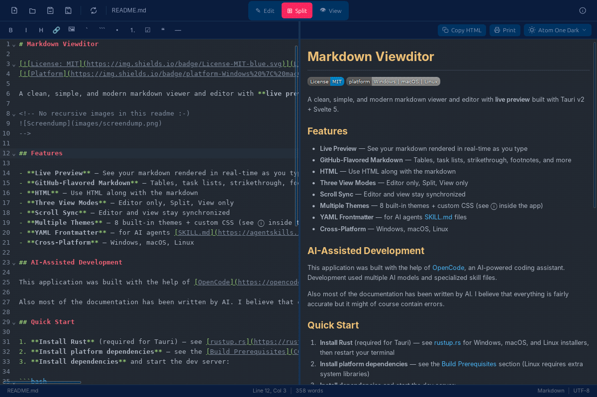

# Markdown Viewditor

[](LICENSE)
[]()

A clean, simple, and modern markdown viewer and editor with **live preview** and **scroll sync** built with Tauri v2 + Svelte 5.



## Features

- **Live Preview** — See your markdown rendered in real-time as you type
- **Three View Modes** — Editor only, Split, View only
- **Scroll Sync** — Editor and view stay synchronized
- **Math Formulas** — Advanced mathematical formulas using [KaTeX](https://katex.org)
- **Chemical Formulas** — Chemical equations and physical units using [mhchem](https://mhchem.github.io/MathJax-mhchem/)
- **Export** — Self-contained HTML (inlined CSS/fonts/images) and PDF/Print
- **Multiple Themes** — 8 built-in themes + custom CSS themes (see ⓘ inside the app)
- **Markdown Compatibility Levels** — Set target level and get soft editor warnings
- **HTML** — Use HTML along with the markdown
- **YAML Frontmatter** — for example AI agents [SKILL.md](https://agentskills.io) files
- **Cross-Platform** — Windows, macOS, Linux

## AI-Assisted Development

This application was built with the help of [OpenCode](https://opencode.ai), an AI-powered coding assistant. Development used multiple AI models.

Also most of the documentation was written by AI.

## Download

[Pre-built binaries for Windows, macOS, and Linux](../../releases/latest) are published on the
Github [Releases page](../../releases/latest). Pick the file matching your platform:

| Platform | File                                                         | Notes                                                                    |
| -------- | ------------------------------------------------------------ | ------------------------------------------------------------------------ |
| Windows  | `Markdown-Viewditor_*_x64-setup.exe` (NSIS) or `.msi`        | SmartScreen may warn on first launch — click **More info → Run anyway**. |
| macOS    | `Markdown-Viewditor_*_universal.dmg` (Intel & Apple Silicon) | See [macOS first-launch note](#macos-first-launch-note) below.           |
| Linux    | `*.deb` (Debian/Ubuntu) or `*.rpm` (Fedora/RHEL)             | Install via your package manager.                                        |

### macOS first-launch note

The macOS build is **not code-signed** (to keep releases free). The first time
you open it, Gatekeeper will block it. To bypass:

```bash
xattr -dr com.apple.quarantine "/Applications/Markdown Viewditor.app"
```

or right-click the app → **Open** → **Open anyway**.

### Auto-updates

The Windows and macOS builds check the GitHub Releases feed for
updates and can install them in place (Help → About → Check for Updates).

## Markdown Compatibility Levels

The status bar exposes a level selector and a per-feature checklist so you can
target a compatibility level. When the document uses syntax that the chosen
level doesn't enable, the editor shows a lint warning on the relevant line and
the status bar shows an amber `⚠ N` badge. Rendering is never restricted —
this is a portability indicator, not a hard limit.

| Level    | Enabled features                                                           |
| -------- | -------------------------------------------------------------------------- |
| Basic    | CommonMark core only (untoggleable)                                        |
| GitHub   | Tables, strikethrough, task lists, bare-URL autolinks, footnotes, raw HTML |
| Advanced | All of GitHub + YAML frontmatter                                           |
| Custom   | Whatever you toggle on                                                     |

**Why is raw HTML a toggle if it's CommonMark core?** It's the most practically
relevant portability knob: GitHub sanitizes a subset, many renderers strip it,
and it's a security surface. Default off at Basic, on at GitHub+Advanced;
strict-CommonMark users re-enable it under Custom.

The `<https://…>` autolink form is CommonMark basic and never triggers the
"autolinks" toggle — that toggle is for bare-URL autolinks (e.g. `https://…`
written without angle brackets, expanded by the linkify rule).

## Mathematics Formulas

See [Math-Example.md](examples/Math-Example.md) for examples.

Markdown Viewer includes [KaTeX](https://katex.org) / [KaTeX Docs](https://katex.org/docs/supported) rendering of math using any of multiple delimiter rules to allow markdown copied from the most used AI chat bots to be viewed.

| Delimiter (inline) | Delimiter (block)                                 | As used by                       |
| ------------------ | ------------------------------------------------- | -------------------------------- |
| `\( … \)`          | `\[`<br>&thinsp; `…` <br>`\]`                     | ChatGPT, Claude                  |
| `$ … $`            | `$$` `…` `$$`                     | Copilot / Github, Gemini, Claude |
|                    | `\begin{align}`<br>&thinsp; `…` <br>`\end{align}` | Many                             |
|                    | ` ```math`<br>&thinsp; `…` <br>` ``` `            | Many                             |

Pandoc delimiter rules (opening `$` not followed by space; closing `$` not
followed by digit) prevent false positives with prices like `$5 and $10`.

## Chemical Formulas

See [Chemistry-Example.md](examples/ChemLab-Example.md) and [ChemLab-Example.md](examples/Chemistry-Example.md) for examples.

Markdown Viewditor includes [mhchem](https://mhchem.github.io/MathJax-mhchem/) for writing chemical equations and physical units. Use the `\ce{…}` command inside any math delimiter:

```
$\ce{H2O}$           — water
$\ce{CO2 + C -> 2CO}$ — a reaction equation
$\ce{^{227}_{90}Th}$ — isotopes
$\pu{123 kJ/mol}$    — physical units
```

The `\ce{…}` and `\pu{…}` commands work inside all supported math delimiters
(`$…$`, `$$…$$`, `\(…\)`, `\[…\]`, bare `\begin{}`, and ` ```math ` fences).

## Custom Themes

See documentation inside the app in the Information Dialog (click ⓘ to open) and see example custom themes in [examples/custom_themes/](./examples/custom_themes/).
To make a new custom theme available in the app, copy a custom theme `.css` file to the themes directory:

| Platform | Path                                                                                |
| -------- | ----------------------------------------------------------------------------------- |
| Linux    | `~/.config/com.github.paw-hermansen.markdown-viewditor/themes/`                     |
| macOS    | `~/Library/Application Support/com.github.paw-hermansen.markdown-viewditor/themes/` |
| Windows  | `%APPDATA%\com.github.paw-hermansen.markdown-viewditor\themes\`                     |

Theme type (dark/light) is auto-detected from the CSS content.

## Project Quick Start

1. **Install Rust** (required for Tauri) — see [rustup.rs](https://rustup.rs) for Windows, macOS, and Linux installers, then restart your terminal
2. **Install platform dependencies** — see the [Build Prerequisites](CONTRIBUTING.md#build-prerequisites) section (Linux requires extra system libraries)
3. **Install dependencies** and start the dev server:

```bash
npm install
npm run tauri dev
```

Mobile (Android, iOS) is technically supported by Tauri v2 but untested. A markdown editor on a phone is... an experiment. Contributions welcome.

In fact, all contributions are welcome! Anyone may [open an issue](../../issues) (bug reports and suggestions alike) or submit a pull request — whether human-created, AI-created, or any mix of both. All pull requests will be reviewed and approved or denied by the maintainer.

Please read the [Contributing Guide](CONTRIBUTING.md) for the PR workflow, checklists, and development setup, and the [Code of Conduct](CODE_OF_CONDUCT.md) before participating.

For technical documentation on architecture, coding conventions, and the release pipeline, see [AGENTS.md](AGENTS.md).

## License

MIT — see [LICENSE](LICENSE) for details.
