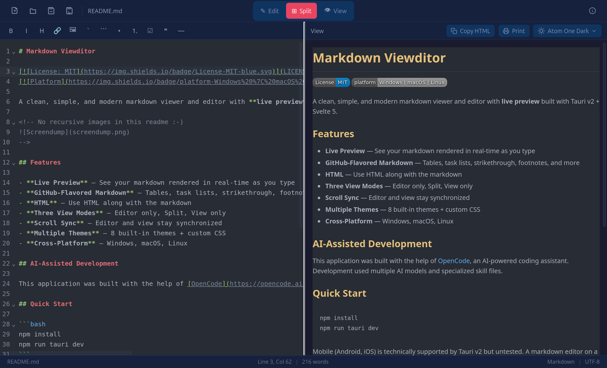

# Markdown Viewditor

[](LICENSE)
[]()

A clean, simple, and modern markdown viewer and editor with **live preview** built with Tauri v2 + Svelte 5.

<!-- Screenshot/GIF placeholder -->



## Features

- **Live Preview** — See your markdown rendered in real-time as you type
- **GitHub-Flavored Markdown** — Tables, task lists, strikethrough, footnotes, and more
- **Three View Modes** — Editor only, Split, View only
- **Scroll Sync** — Editor and view stay synchronized
- **Multiple Themes** — 8 built-in themes + custom CSS
- **Cross-Platform** — Windows, macOS, Linux

## AI-Assisted Development

This application was built with the help of [OpenCode](https://opencode.ai), an AI-powered coding assistant. Development used multiple AI models and specialized skill files.

## Quick Start

```bash
npm install
npm run tauri dev
```

Mobile (Android, iOS) is technically supported by Tauri v2 but untested. A markdown editor on a phone is... an experiment. Contributions welcome.

## Custom Themes

Place `.css` files in the themes directory:

| Platform | Path                                                                                |
| -------- | ----------------------------------------------------------------------------------- |
| Linux    | `~/.config/com.github.paw-hermansen.markdown-viewditor/themes/`                     |
| macOS    | `~/Library/Application Support/com.github.paw-hermansen.markdown-viewditor/themes/` |
| Windows  | `%APPDATA%\com.github.paw-hermansen.markdown-viewditor\themes\`                     |

Theme type (dark/light) is auto-detected from the CSS content.

## License

MIT — see [LICENSE](LICENSE) for details.
