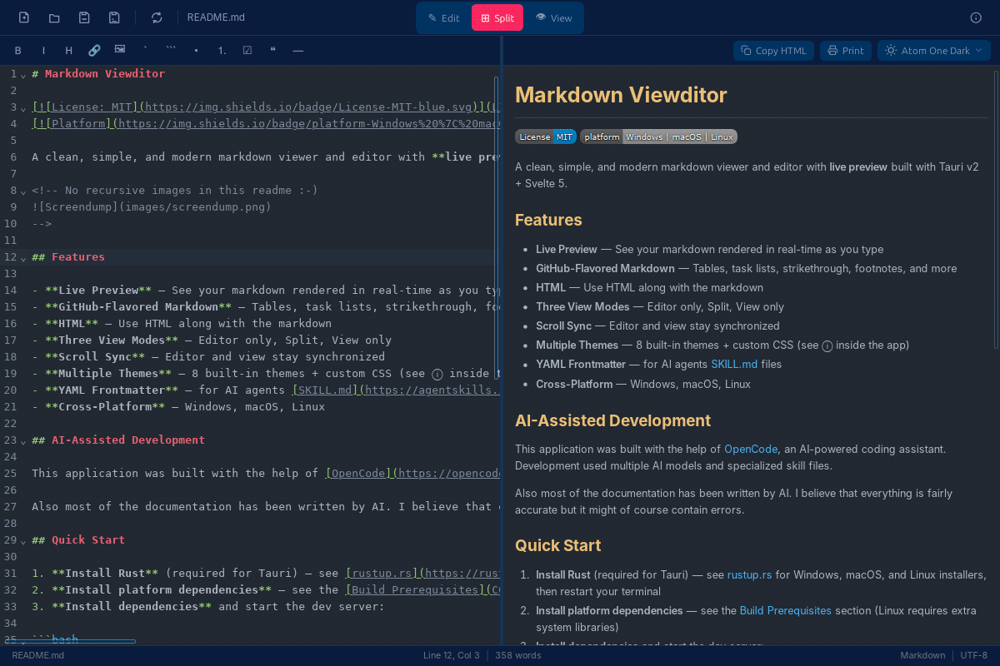
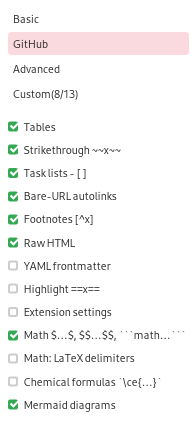
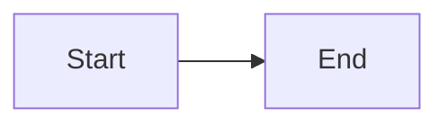
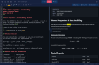
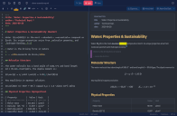
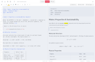
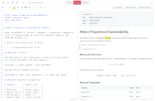
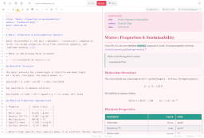

# Markdown Viewditor

[](LICENSE)
[](<>)

A feature-rich and simple cross-platform markdown viewer and editor with live preview and scroll sync built with Tauri v2 + Svelte 5.



## Features

- **Live Preview** — See your markdown rendered in real-time as you type
- **Three View Modes** — Editor only, Split, View only
- **Scroll Sync** — Editor and view stay synchronized
- **Zoom** — Scale the app (70%–300%) with `Ctrl +` / `Ctrl -` / `Ctrl 0`, `Ctrl`+mouse wheel, or the status bar control
- **Math and Chemical Formulas** — Advanced formulas using [KaTeX](https://katex.org) and [mhchem](https://mhchem.github.io/MathJax-mhchem/)
- **Mermaid Diagrams** — Flowcharts, sequence diagrams, Gantt charts and more, rendered with [Mermaid](https://mermaid.ai)
- **Export** — Self-contained HTML, ODT (most wordprocessors) and PDF/Print
- **Dark/light Themes** — 8 built-in themes + custom CSS themes
- **Markdown Compatibility Levels** — Set target level and get soft editor warnings
- **HTML** — Use HTML along with the markdown
- **YAML Frontmatter** — for example AI agents [SKILL.md](https://agentskills.io) files
- **Cross-Platform** — Windows, macOS, Linux

## Documentation

| Guide                                  | Description                                          |
| -------------------------------------- | ---------------------------------------------------- |
| [Markdown Examples](docs/Examples.md)  | Syntax reference for all supported markdown features |
| [Custom Themes](docs/CustomThemes.md)  | Creating and installing custom CSS themes            |
| [Math Formulas](docs/Math.md)          | KaTeX math rendering and delimiter syntax            |
| [Chemical Formulas](docs/Chemistry.md) | mhchem equations and physical units                  |
| [Mermaid Diagrams](docs/Mermaid.md)    | Diagram types, host options and export behavior      |

## Install and Auto-Updates

- GitHub [Releases page](../../releases/latest) has install packages for Windows, macOS, and Linux.

(`*.sig` files and `latest.json` on the Releases page are for the built-in [updater](#auto-updates).)

### Windows

| Your PC                                          | File to download                    |
| ------------------------------------------------ | ----------------------------------- |
| 64-bit Intel or AMD (almost all PCs) - preferred | `MarkdownViewditor_*_x64-setup.exe` |
| Classic Windows Installer package                | `MarkdownViewditor_*_x64_en-US.msi` |

To install:

1. Open the downloaded `.exe` file (click it in the browser's download list, or double-click it in your Downloads folder).
2. If Windows shows a blue **"Windows protected your PC"** message, click **More info** and then **Run anyway**. The app is not code-signed, so this warning is expected and harmless - if you trust me.
3. Follow the steps in the setup program, then start **Markdown Viewditor** from the Start menu.

### macOS

One file works for both kinds of Mac:

| Your Mac                             | File to download                    |
| ------------------------------------ | ----------------------------------- |
| Apple Silicon (M1–M4) and Intel Macs | `MarkdownViewditor_*_universal.dmg` |

To install:

1. Open the downloaded `.dmg` file.
2. In the window that opens, drag **Markdown Viewditor** onto the **Applications** folder.
3. Open the app from the Applications folder (or Launchpad). You can delete the downloaded `.dmg` afterwards.

**First launch:** the app is not code-signed (to keep releases free), so
macOS refuses to open it the first time. Click **OK** in the message, then
right-click the app in Finder, choose **Open**, and click **Open** again in
the next dialog. (If you prefer the Terminal, this one-time command has the
same effect:)

```bash
xattr -dr com.apple.quarantine "/Applications/Markdown Viewditor.app"
```

### Linux

Linux installers come in two package formats. First pick the one your Linux
distribution uses:

- **`.deb`** — Debian, Ubuntu, Linux Mint, Pop!_OS and similar distributions
- **`.rpm`** — Fedora, Red Hat Enterprise Linux, openSUSE and similar distributions

Then pick the file matching your processor:

| Your processor                                  | `.deb` (Debian/Ubuntu…)         | `.rpm` (Fedora/RHEL…)             |
| ----------------------------------------------- | ------------------------------- | --------------------------------- |
| Intel/AMD 64-bit (most PCs and laptops)         | `MarkdownViewditor_*_amd64.deb` | `MarkdownViewditor-*.x86_64.rpm`  |
| ARM 64-bit (e.g. Raspberry Pi 4/5, ARM servers) | `MarkdownViewditor_*_arm64.deb` | `MarkdownViewditor-*.aarch64.rpm` |

Not sure which processor you have? Run `uname -m` in a terminal: `x86_64`
means Intel/AMD, `aarch64` means ARM.

To install, either:

- **Double-click** the downloaded file — it opens in your distribution's graphical package installer, where you click **Install** and enter your password.
- **Or** install it from a terminal (run the command in the folder where you downloaded the file):
  - `.deb`: `sudo apt install ./MarkdownViewditor_*_amd64.deb`
  - `.rpm`: `sudo dnf install ./MarkdownViewditor-*.x86_64.rpm`

Afterwards, **Markdown Viewditor** appears in your application menu.

### Auto-Updates

All desktop builds (Windows, macOS, and Linux deb/rpm) can check the GitHub
Releases feed for updates and install them in place via **Help → About → Check
for Updates**. Auto-check on startup is off by default — enable it with the
checkbox in the About dialog.

In-app updates are disabled when running inside Linux Snaps or the Windows
Store.

## Markdown Compatibility Levels

The status bar exposes a level selector and a per-feature checklist so you can
target a compatibility level. When the document uses syntax that the chosen
level doesn't enable, the editor shows a lint warning on the relevant line and
the status bar shows an amber `⚠ N` badge. Rendering is never restricted —
this is a portability indicator, not a hard limit.



| Level    | Enabled features                                                           |
| -------- | -------------------------------------------------------------------------- |
| Basic    | CommonMark core only (untoggleable)                                        |
| GitHub   | Tables, strikethrough, task lists, bare-URL autolinks, footnotes, raw HTML |
| Advanced | All of GitHub + YAML frontmatter                                           |
| Custom   | Whatever you toggle on                                                     |

**Why is raw HTML a toggle if it's CommonMark core?** It's the most practically
relevant portability knob: GitHub sanitizes a subset, many renderers strip it,
and it's a security surface. Default off at Basic, on at GitHub+Advanced;
strict-CommonMark users re-enable it under Custom.

The `<https://…>` autolink form is CommonMark basic and never triggers the
"autolinks" toggle — that toggle is for bare-URL autolinks (e.g. `https://…`
written without angle brackets, expanded by the linkify rule).

## Mathematics Formulas in Formats From Most AI Chat Bots

See [Math.md](docs/Math.md) for all delimiter syntax and formula examples.

Markdown Viewer includes [KaTeX](https://katex.org) / [KaTeX Docs](https://katex.org/docs/supported) rendering of math using any of multiple delimiter rules to allow markdown copied from the most used AI chat bots to be viewed.

| Delimiter (inline) | Delimiter (block)                                 | As used by                       |
| ------------------ | ------------------------------------------------- | -------------------------------- |
| `\( … \)`          | `\[`<br>&thinsp; `…` <br>`\]`                     | ChatGPT, Claude                  |
| `$ … $`            | `$$` `…` `$$`                                     | Copilot / Github, Gemini, Claude |
|                    | `\begin{align}`<br>&thinsp; `…` <br>`\end{align}` | Many                             |
|                    | ` ```math`<br>&thinsp; `…` <br>` ``` `            | Many                             |

Pandoc delimiter rules (opening `$` not followed by space; closing `$` not
followed by digit) prevent false positives with prices like `$5 and $10`.

## Chemical Formulas

See [Chemistry.md](docs/Chemistry.md) for formula examples and physical units.

Markdown Viewditor includes [mhchem](https://mhchem.github.io/MathJax-mhchem/) for writing chemical equations and physical units. Use the `\ce{…}` command inside any math delimiter:

```
$\ce{H2O}$           — water
$\ce{CO2 + C -> 2CO}$ — a reaction equation
$\ce{^{227}_{90}Th}$ — isotopes
$\pu{123 kJ/mol}$    — physical units
```

The `\ce{…}` and `\pu{…}` commands work inside all supported math delimiters
(`$…$`, `$$…$$`, `\(…\)`, `\[…\]`, bare `\begin{}`, and ` ```math ` fences).

## Mermaid Diagrams

See [Mermaid.md](docs/Mermaid.md) for diagram types, host options, and export behavior.

Markdown Viewditor renders [Mermaid](https://mermaid.js.org) diagrams from fenced
code blocks with the `mermaid` language identifier. Mermaid is loaded lazily — it
only activates when your document contains a `mermaid` code block:


```mermaid
graph LR
    A[Start] --> B[End]
```

Supported diagram types include flowcharts, sequence diagrams, class diagrams,
state diagrams, ER diagrams, Gantt charts, pie charts, mind maps, and more.
Diagram themes follow the app's dark/light theme unless overridden with Mermaid
YAML frontmatter, and layout options (alignment, maximum width, width fitting)
can be set per block with fence attributes or document-wide with HTML comment
directives. Diagrams export to HTML and PDF as inline/vector SVG.

## Themes

### Examples of Built-in themes






### Custom Themes

See [Custom Themes documentation](docs/CustomThemes.md) for full reference, and example themes in [testing/custom_themes/](./testing/custom_themes/).
To make a new custom theme available in the app, copy a custom theme `.css` file to the themes directory:

| Platform | Path                                                                                |
| -------- | ----------------------------------------------------------------------------------- |
| Linux    | `~/.config/com.github.paw-hermansen.markdown-viewditor/themes/`                     |
| macOS    | `~/Library/Application Support/com.github.paw-hermansen.markdown-viewditor/themes/` |
| Windows  | `%APPDATA%\com.github.paw-hermansen.markdown-viewditor\themes\`                     |

Theme type (dark/light) is auto-detected from the CSS content.

The example custom theme [Custom Theme Bubblegum](testing/custom_themes/theme-bubblegum.css):



## Troubleshooting

### "WebKit encountered an internal error" — the app shows only an error page

This is a known WebKitGTK bug
([276312](https://bugs.webkit.org/show_bug.cgi?id=276312)), not an app bug: a
page load fails inside the engine (`WebLoaderStrategy.cpp:
internallyFailedLoadTimerFired`), and once that happens the webview cache can
stay in a state where every start fails the same way.

Fix — clear the webview cache and start again:

```bash
npm run clean:webview-cache
npm run tauri dev
```

The script removes only the engine cache (app settings and window state are
kept). On Linux the cache is
`~/.local/share/com.github.paw-hermansen.markdown-viewditor/WebKitCache`.

Also worth knowing:

- The same error is reported on Wayland sessions; if clearing the cache does
  not help, try `GDK_BACKEND=x11 npm run tauri dev` to see whether the
  compositor is involved (one report shows the error following `Error 71
(Protocol error) dispatching to Wayland display`).
- The message can also appear as harmless noise when a window is closed while
  a page is still loading.
- The engine fix landed upstream (WebKit commit `310907@main`, April 2026)
  and reaches users through distro WebKitGTK updates.

---

## AI-Augmented Development

This application was built with the help of [OpenCode](https://opencode.ai),
an AI-powered coding assistant. Development used different AI models, some free
and some paid. Also most of the documentation was written by AI.

I'm a Senior Software Developer and I wrote my first software back in the
1970's. Yes, around the time when smoking was normal, everyone said "10-4", were
fascinated by Lava Lamps, and listened to Disco music. Phones were anchored to a
geographic location instead of to a person and nobody had yet invented the Internet.
I've been building software for a living my entire career until I retired in 2025.

I'm still coding for fun and I couldn't find a Markdown viewer and editor
that I liked, so I used the summer 2026 to write the Markdown desktop app
that is perfect for me and at the same time to test if AI coding assistants
are any good.

It turned out that my AI assistant was surprisingly knowledgeable and understood
what I meant (most of the time). Sometimes my assistant lacked intelligence
and experience and therefore it required constant supervision
and guidance from an experienced software developer - which in my experience is also true
for many human programmers.

Read more details on [my homepage](https://pawhermansen.dk/2026/09/13/what-is-wrong-with-ai-and-how-to-have-fun-doing-ai-augmented-coding/).

## Project Quick Start

1. **Install Rust** (required for Tauri) — see [rustup.rs](https://rustup.rs) for Windows, macOS, and Linux installers, then restart your terminal
2. **Install platform dependencies** — see the [Build Prerequisites](CONTRIBUTING.md#build-prerequisites) section (Linux requires extra system libraries)
3. **Install dependencies** and start the dev server:

```bash
npm install
npm run tauri dev
```

Mobile (Android, iOS) is technically supported by Tauri v2 but untested. A markdown editor on a phone is... an experiment. Contributions welcome.

In fact, all contributions are welcome! Anyone may [open an issue](../../issues) (bug reports and suggestions alike) or submit a pull request — whether human-created, AI-created, or any mix of both. All pull requests will be reviewed and approved or denied by the maintainer.

Please read the [Contributing Guide](CONTRIBUTING.md) for the PR workflow, checklists, and development setup, and the [Code of Conduct](CODE_OF_CONDUCT.md) before participating.

For technical documentation on architecture, coding conventions, and the release pipeline, see [AGENTS.md](AGENTS.md).

## License

MIT — see [LICENSE](LICENSE) for details.
