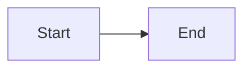
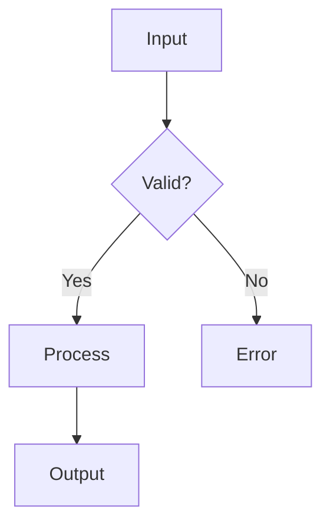
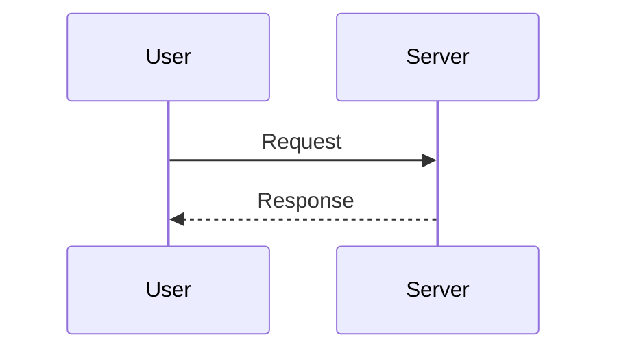
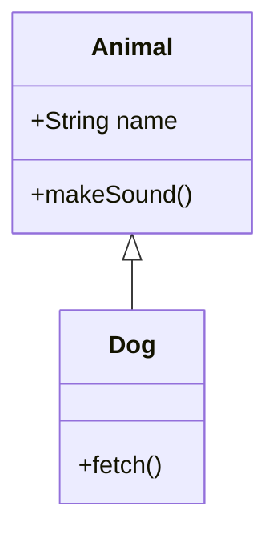
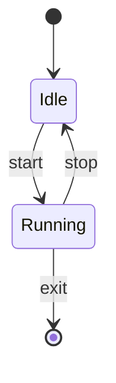
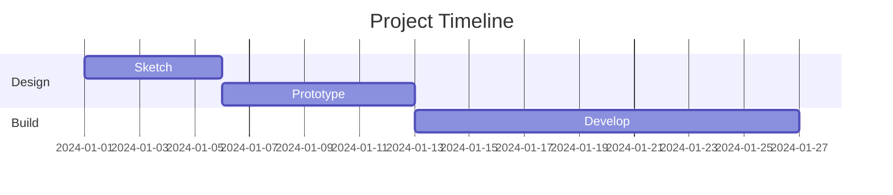
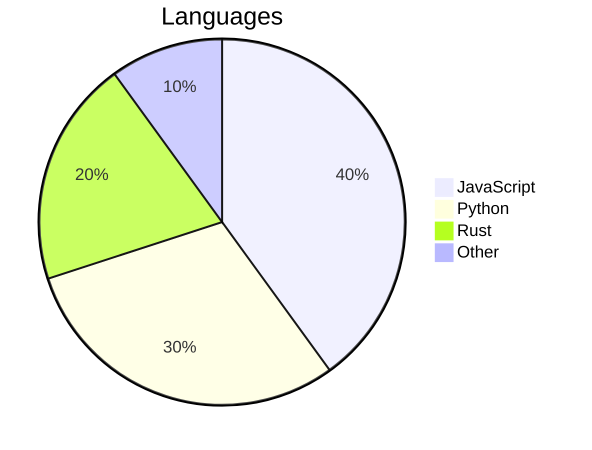
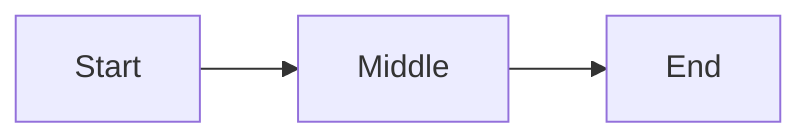

# Mermaid Diagrams

Markdown Viewditor renders diagrams via [Mermaid](https://mermaid.js.org). Diagrams work in all view modes and export to HTML and PDF. Mermaid is loaded lazily — it only activates when your document contains a `mermaid` code block.

## Quick Start

Write a fenced code block with the `mermaid` language identifier:

````

````


## Diagram Types

Mermaid supports many diagram types. Here are some common ones:

### Flowchart

````

````


### Sequence Diagram

````

````


### Class Diagram

````

````


### State Diagram

````

````


### Gantt Chart

````

````


### Pie Chart

````

````


For the full list of diagram types and their syntax, see the [Mermaid documentation](https://mermaid.js.org/intro/).

## Settings

Mermaid rendering has two separate configuration layers:

- **Viewditor host options** control the outer diagram host: alignment, maximum width, and width fitting.
- **Mermaid YAML frontmatter** controls Mermaid's native diagram configuration, including themes, theme variables, layout, spacing, and font sizes.

Viewditor host options can be set per block with fence attributes or positionally with standalone HTML comment directives. `theme` is not a Viewditor host option and is not available in directives or fenced Mermaid attributes.

### Fence Attributes (per-block)

Fence attributes are placed in `{...}` after the `mermaid` language identifier. They apply only to that block.

| Attribute    | Type    | Default  | Values                    | Description                                                      |
| ------------ | ------- | -------- | ------------------------- | ---------------------------------------------------------------- |
| `align`      | string  | `center` | `left`, `center`, `right` | Horizontal alignment when the host is narrower than the content  |
| `maxWidth`   | number  | `800`    | 200-2000                  | Maximum outer host width in pixels                               |
| `fitToWidth` | boolean | `true`   | `true`, `false`           | Scale the diagram to the host width (`false` keeps natural size) |

Examples:

````

````


````

````


````

````


### HTML Comment Directives (document-level)

Directives are standalone HTML comments placed on their own line. Their settings become effective from that position forward, until changed by another directive or the end of the file. Each directive changes only the keys it names; omitted keys keep their previous values.

```markdown
<!-- mermaid: align=left maxWidth=600 -->
<!-- mermaid: fitToWidth=false -->
```

The second directive changes only `fitToWidth`; `align` and `maxWidth` remain in effect.

### Scoping

How directives and fence attributes interact:

- **Document directives** (`<!-- mermaid: ... -->`) apply to Mermaid fences after their position.
- **Fence attributes** (` ```mermaid {...} `) override the effective directive values for that block only.
- A fence override does not change the directive state used by later blocks.

#### Example

A document sets `align=left` and `maxWidth=600`, then one block overrides only `align`. A later directive changes only `maxWidth`, so `align=left` persists:

````markdown
```mermaid
graph LR
    A[First] --> B[Second]
```
````

```mermaid
graph LR
    A[First] --> B[Second]
```

````markdown
<!-- mermaid: align=left maxWidth=600 -->

```mermaid
graph LR
    A[First] --> B[Second]
```
````

<!-- mermaid: align=left maxWidth=600 -->

```mermaid
graph LR
    A[First] --> B[Second]
```

````markdown
```mermaid {align=right}
graph LR
    C[Third] --> D[Fourth]
```
````

```mermaid {align=right}
graph LR
    C[Third] --> D[Fourth]
```

````markdown
<!-- mermaid: maxWidth=200 -->

```mermaid
graph LR
    E[Fifth] --> F[Sixth]
```
````

<!-- mermaid: maxWidth=200 -->

```mermaid
graph LR
    E[Fifth] --> F[Sixth]
```

Set back to default values for later diagrams:
```markdown
<!-- mermaid: !maxWidth !align -->
```

<!-- mermaid: !maxWidth !align -->

| Diagram | Effective host options                            | Source                            |
| ------- | ------------------------------------------------- | --------------------------------- |
| First   | `align=center`, `maxWidth=800`, `fitToWidth=true` | Default                           |
| Second  | `align=left`, `maxWidth=600`, `fitToWidth=true`   | First directive                   |
| Third   | `align=right`, `maxWidth=600`, `fitToWidth=true`  | Directive + fence override        |
| Fourth  | `align=left`, `maxWidth=200`, `fitToWidth=true`   | Later directive; `align` persists |

The fenced block does not affect surrounding diagrams; it overrides only its own block.

## Theme Behavior

When a diagram does not set `config.theme` in Mermaid frontmatter, the app-selected theme is the default Mermaid theme:

- App dark selects Mermaid `dark`.
- App light selects Mermaid `default`.

Mermaid frontmatter can override the app-selected theme with `config.theme`. `config.theme: default` means Mermaid's native default theme; it does not mean "follow the app".

## Scaling vs Scrolling

The outer host width is the smaller of `maxWidth` and the available content width. When `maxWidth` is less than the content width, `align=left`, `align=center`, or `align=right` positions that narrower host. If `maxWidth` is at least the content width, the host fills the available width and alignment has no visible effect.

- **`fitToWidth=true`** (default) - the diagram scales to fit the host width. Content is not clipped, but very large diagrams may become small.
- **`fitToWidth=false`** - the diagram renders at its natural size and uses horizontal scrolling when it exceeds the host width. There is no vertical scrolling and no `maxHeight` option; tall diagrams expand vertically.

### Scaling

````
```mermaid {fitToWidth=true}
flowchart LR
    A[Step 1] --> B[Step 2] --> C[Step 3] --> D[Step 4] --> E[Step 5] --> F[Step 6]
```
````

```mermaid {fitToWidth=true}
flowchart LR
    A[Step 1] --> B[Step 2] --> C[Step 3] --> D[Step 4] --> E[Step 5] --> F[Step 6]
```

### Scrollbar

````
```mermaid {fitToWidth=false}
flowchart LR
    A[Step 1] --> B[Step 2] --> C[Step 3] --> D[Step 4] --> E[Step 5] --> F[Step 6]
```
````

```mermaid {fitToWidth=false}
flowchart LR
    A[Step 1] --> B[Step 2] --> C[Step 3] --> D[Step 4] --> E[Step 5] --> F[Step 6]
```

## Per-Diagram Frontmatter

Mermaid also supports YAML frontmatter at the top of a diagram for native configuration such as themes, node spacing, font sizes, and more. Frontmatter controls the Mermaid diagram itself; Viewditor options control the outer host layout.

````
```mermaid
---
config:
  theme: forest
---
graph LR
    A[Styled] --> B[Node]
```
````

```mermaid
---
config:
  theme: forest
---
graph LR
    A[Styled] --> B[Node]
```

````
```mermaid
---
config:
  theme: base
  themeVariables:
    primaryColor: '#ffeecc'
    lineColor: '#ffbb33'
---
graph LR
    A[Styled] --> B[Node]
```
````

```mermaid
---
config:
  theme: base
  themeVariables:
    primaryColor: '#ffeecc'
    lineColor: '#ffbb33'
---
graph LR
    A[Styled] --> B[Node]
```

See [Mermaid configuration](https://mermaid.js.org/config/configuration.html) for all available frontmatter options.

## Invalid Diagrams

Unrecognized or malformed diagram syntax renders as the source code with an error message instead of crashing. This lets you view documents with partial Mermaid support.

````
```mermaid
nonsense
    A --> B
```
````

```mermaid
nonsense
    A --> B
```

## Export

| Format | Behavior                                       |
| ------ | ---------------------------------------------- |
| HTML   | Diagrams are inline SVG — fully self-contained |
| PDF    | Vector SVG — prints cleanly at any resolution  |
| ODT    | Mermaid fences are exported as source code     |

## Mermaid Reference

Mermaid supports dozens of diagram types including flowcharts, sequence diagrams, class diagrams, state diagrams, ER diagrams, Gantt charts, pie charts, mind maps, and more.

**[Mermaid documentation](https://mermaid.js.org/intro/)** — full syntax reference for all diagram types
