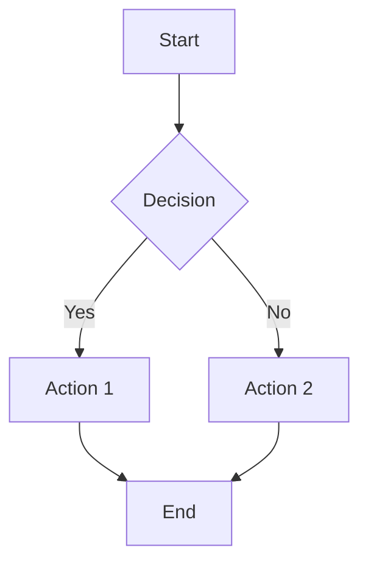
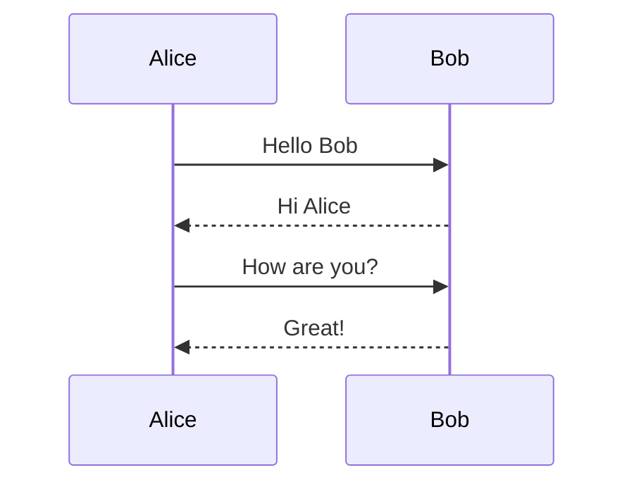
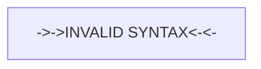
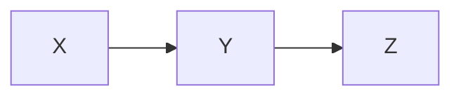
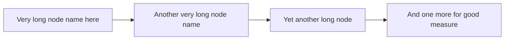
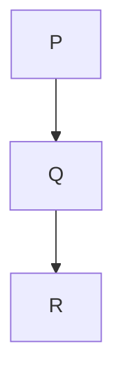
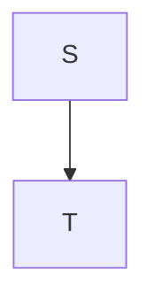
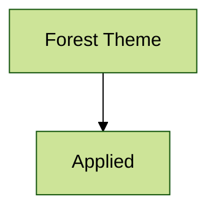

# Math, Chemistry & Mermaid — All Features

This file exercises every math delimiter style, chemistry syntax, and Mermaid
diagram variant, including fence attributes and HTML comment directives.

---

## Math — Dollar Delimiters

### Inline Dollar

The Pythagorean theorem: $a^2 + b^2 = c^2$.

A sentence with a price like $5 and $10 is NOT math — the dollar rules
reject prices (opening `$` followed by space, closing `$` followed by a digit).

### Block Dollar

$$
\frac{-b \pm \sqrt{b^2 - 4ac}}{2a}
$$

### Matrices

$$
\begin{pmatrix}
a & b \\
c & d
\end{pmatrix}
\begin{pmatrix}
x \\
y
\end{pmatrix}
=
\begin{pmatrix}
ax + by \\
cx + dy
\end{pmatrix}
$$

### Cases

$$
f(x) = \begin{cases}
1 & \text{if } x > 0 \\
0 & \text{if } x \leq 0
\end{cases}
$$

---

## Math — Bracket Delimiters (LaTeX)

### Inline Bracket

Euler's identity: \( e^{i\pi} + 1 = 0 \).

### Block Bracket

\[
\int_{-\infty}^{\infty} e^{-x^2} \, dx = \sqrt{\pi}
\]

---

## Math — Bare `\begin{...}` Blocks

\begin{align}
\nabla \times \vec{B} - \frac{1}{c} \frac{\partial \vec{E}}{\partial t}
  &= \frac{4\pi}{c} \vec{j} \\
\nabla \cdot \vec{E} &= 4 \pi \rho
\end{align}

---

## Math — Fenced ` ```math ` Blocks

```math
\sum_{n=1}^{\infty} \frac{1}{n^2} = \frac{\pi^2}{6}
```

### Fenced Anonymous Block (should NOT render as math — plain code)

```
\sum_{n=1}^{\infty} \frac{1}{n^2} = \frac{\pi^2}{6}
```

---

## Math — Very Wide Block (should scroll horizontally)

$$
\begin{aligned}
\mathcal{L}(\theta) ={}& -\sum_{i=1}^{n} \log p(y_i \mid x_i, \theta) + \lambda_1 \lVert\theta\rVert_1 + \lambda_2 \lVert\theta\rVert_2^2 + \alpha\,\mathrm{tr}(\Sigma^{-1}S) + \beta\,\log\det(\Sigma) + \gamma\,\mathrm{KL}(q(z) \mathbin\Vert p(z)) + \delta\,\mathbb{E}_{z\sim q(z)}[\lVert f_\theta(z) - y\rVert_2^2]
\end{aligned}
$$

---

## Math — Invalid LaTeX (compact error, no crash)

$$ \undefinedcommand $$

---

## Math — Fence Attributes

### Fontsize Scaling (2×)

The formula below uses `fontsize=2.0` to render at double size:

```math {fontsize=2.0}
\frac{x^2}{y^2}
```

### Left-side Equation Numbers (leqno)

```math {leqno}
E = mc^2 \tag{1}
```

### Flush-left Alignment (fleqn)

```math {fleqn}
\int_0^1 f(x)\,dx = F(1) - F(0)
```

### Combined Attributes (leqno + fontsize)

```math {leqno fontsize=1.5}
a^2 + b^2 = c^2 \tag{2}
```

---

## Math — HTML Comment Directives

### Fontsize Directive

<!-- math: fontsize=1.3 -->

The directive above makes all following math render at 1.3× base size.

Inline: $x^2 + y^2 = z^2$

Block:

$$
\sum_{i=1}^{n} i = \frac{n(n+1)}{2}
$$

### Reset Fontsize

<!-- math: !fontsize -->

The `!fontsize` directive resets back to default (1.0).

$\alpha + \beta = \gamma$

### Leqno Directive

<!-- math: leqno -->

Left-side equation numbers for all following math:

$$
\nabla \cdot \vec{E} = \frac{\rho}{\epsilon_0} \tag{3}
$$

$$
\nabla \times \vec{B} = \mu_0 \vec{j} + \mu_0 \epsilon_0 \frac{\partial \vec{E}}{\partial t} \tag{4}
$$

### Reset Leqno

<!-- math: !leqno -->

Right-side equation numbers again:

$$
F = ma \tag{Right 5}
$$

### Directive on Bracket Math

<!-- math: fontsize=1.5 -->

Scaled bracket inline: \(x^2\)

Scaled bracket block:

\[
\int_0^1 f(x)\,dx
\]

<!-- math: !fontsize -->

### Multiple Directives on One Line

<!-- math: leqno fontsize=2.0 -->

Both leqno and fontsize=2.0 should apply:

$$
a^2 + b^2 = c^2 \tag{6}
$$

<!-- math: !leqno !fontsize -->

### Scoping — Fence Overrides Directive

<!-- math: fontsize=1.5 -->

The fence block below overrides to `fontsize=2.0` (not 1.5×):

```math {fontsize=2.0}
\frac{a}{b}
```

The following block should resume at 1.5× (directive still active):

$$
x + y = z
$$

<!-- math: !fontsize -->

### Directive Comment Not Rendered

<!-- math: leqno -->

The `<!-- math: leqno -->` comment above should NOT appear in the viewer.

<!-- math: !leqno -->

### Unknown Namespace Ignored

<!-- unknown: foo=bar -->

The comment above has an unknown namespace — it should have no effect on math.

---

## Chemistry — Formulas

Water: $\ce{H2O}$. Sulfuric acid: $\ce{H2SO4}$. Glucose: $\ce{C6H12O6}$.

## Chemistry — Charges

Hydrogen ion: $\ce{H+}$. Chromate: $\ce{CrO4^2-}$. Complex ion: $\ce{[AgCl2]-}$.

## Chemistry — Stoichiometric Numbers

$\ce{2H2 + O2 -> 2H2O}$

$\ce{0.5 H2O}$ or $\ce{1/2 H2O}$

## Chemistry — Reaction Arrows

| Syntax | Meaning |
|--------|---------|
| $\ce{A -> B}$ | yields |
| $\ce{A <- B}$ | is produced by |
| $\ce{A <-> B}$ | resonance / equilibrium |
| $\ce{A <=> B}$ | reversible reaction |

Arrows with annotations:

$$
\ce{A ->[\text{heat}][\text{catalyst}] B}
$$

## Chemistry — Isotopes and Bonds

Thorium-227: $\ce{^{227}_{90}Th+}$

Single: $\ce{C6H5-CHO}$. Double: $\ce{CH2=CH2}$. Triple: $\ce{HC#CH}$.

## Chemistry — States of Aggregation

Aqueous: $\ce{CO3^2-_{(aq)}}$

Precipitate: $\ce{BaSO4 v}$

Gas evolved: $\ce{CO2 ^}$

## Chemistry — Physical Units (pu)

Energy: $\pu{123 kJ/mol}$

Speed of light: $\pu{3e8 m\cdot s-1}$

## Chemistry — Inline in Sentences

The combustion of methane is $\ce{CH4 + 2O2 -> CO2 + 2H2O}$, releasing
$\pu{890 kJ\mathbin{/}mol}$ of energy.

## Chemistry — Block Equations

$$
\ce{Zn^2+ <=>[+ 2OH-][+ 2H+] Zn(OH)2 v <=>[+ 2OH-][+ 2H+] [Zn(OH)4]^2-}
$$

## Chemistry — Equilibrium with Math

$$
K = \frac{[\ce{Hg^2+}][\ce{Hg}]}{[\ce{Hg2^2+}]}
$$

## Chemistry — Bracket Delimiters

Inline: \(\ce{H2O}\). Block:

\[
\ce{2H2 + O2 -> 2H2O}
\]

## Chemistry — Fenced Blocks

```math
\ce{CO2 + C -> 2CO}
```

---

## Mermaid — Basic Flowchart



## Mermaid — Sequence Diagram



## Mermaid — Error Case (invalid syntax)



(The above should show a styled error block with the source code, not crash.)

## Mermaid — Fence Attributes

### Align Left, Max Width 400



### Fit to Width Disabled (natural size, scrollable)



## Mermaid — HTML Comment Directives

<!-- mermaid: align=center maxWidth=600 -->

The directive above sets center alignment and max width 600px for following diagrams.



<!-- mermaid: !align !maxWidth -->

After reset, diagrams use defaults.



## Mermaid — Theme Override via YAML Frontmatter

